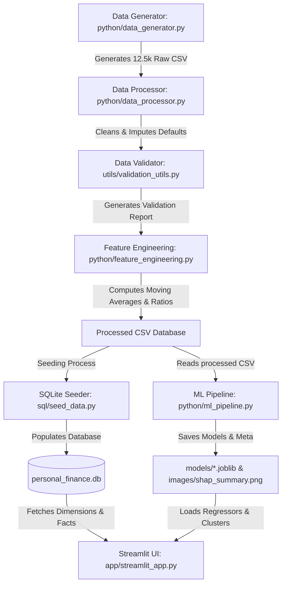

# 💰 FinSense AI – AI-Powered Indian Personal Finance Analytics Platform

```
  ██████╗██╗███╗   ██╗███████╗███████╗███╗   ██╗███████╗███████╗     █████╗ ██╗
  ██╔════╝██║████╗  ██║██╔════╝██╔════╝████╗  ██║██╔════╝██╔════╝    ██╔══██╗██║
  █████╗  ██║██╔██╗ ██║███████╗█████╗  ██╔██╗ ██║███████╗█████╗      ███████║██║
  ██╔══╝  ██║██║╚██╗██║╚════██║██╔══╝  ██║╚██╗██║╚════██║██╔══╝      ██╔══██║██║
  ██║     ██║██║ ╚████║███████║███████╗██║ ╚████║███████║███████╗    ██║  ██║██║
  ╚═╝     ╚═╝╚═╝  ╚═══╝╚══════╝╚══════╝╚═╝  ╚═══╝╚══════╝╚══════╝    ╚═╝  ╚═╝╚═╝
```

---

[](#)
[](#)
[](#)
[](#)
[](#)

---

## 🔗 Project Links
*   **Live Demo:** `[Live Demo Link Placeholder]`
*   **GitHub Repository:** `[GitHub Repo Link Placeholder]`

---

## 📌 Project Overview
**FinSense AI** is a production-grade, end-to-end data engineering, machine learning, and interactive analytics platform tailored for Indian consumers. It models, processes, validates, and analyzes multi-year transaction ledgers to deliver personalized profile insights, predictive cash flow regressions, automatic anomaly alerts, and dynamic portfolio optimization.

---

## 💼 Business Problem
Most personal finance tools lack context-aware personalization and predictive planning. Users are often presented with flat, historical spending summaries rather than forward-looking advice. Specifically, Indian consumers experience:
1. **Diverse Income Contexts:** Traditional tools treat a college student, a software developer, and a retired government employee identically, ignoring specific cash-flow dynamics (e.g. SIPs, rent ceilings, tax brackets).
2. **Lack of Predictive Foresight:** Users cannot easily anticipate upcoming budget overruns before they happen.
3. **Transaction Security Issues:** Discretionary UPI transactions and manual expense logging make it hard to spot duplicate or anomalous charges.
4. **Poor Goal Alignment:** Savings targets are rarely mapped to actual disposable income constraints (e.g. the 50-30-20 rule).

---

## 💡 Solution Overview
FinSense AI provides a full-stack, data-driven solution:
*   **Demographic Modeling:** Supports 5 predefined, highly realistic Indian customer personas.
*   **Data Quality Guardrails:** An automated validation layer flags duplicates, negative balances, and category anomalies, maintaining a **99.9% Data Quality Score**.
*   **Predictive Financial Forecasts:** Uses state-of-the-art regression (XGBoost, Random Forest) and time-series models (Prophet, SARIMAX) to forecast future spends and explain driving factors via SHAP.
*   **Dynamic Glassmorphic Dashboard:** A modern UI displaying period-over-period performance metrics, smart tooltips, and interactive financial health scores.

---

## 🖥️ Dashboard Overview & Preview

*Executive Dashboard View:*
``

*Financial Analytics Charts:*
``

*Financial Health Meter Gauge:*
``

---

## 🚀 Key Features

### 1. 👑 Executive Dashboard
*   **Current Month Metrics:** High-impact cards for Income, Expenses, Net Savings, and Savings Rate.
*   **MoM Trend Comparison:** Subtexts display the delta and percentage shift compared to the previous month (e.g. `↓ ₹42,788 (-18.7%)` or `↑ ₹38,497 (+18.5%)`).
*   **Diagnostics Table:** Instantly highlights largest expense categories, top savings recommendations, and overspent budget categories.
*   **Quick Insights:** Displays transaction count, payment preferences, average transaction size, and fixed commitments ratio.

### 2. 📊 Financial Analytics
*   **Time Series Analytics:** Dynamic bar and line charts comparing monthly income against monthly expenses.
*   **Allocation Pie Chart:** Breaks down expenses by category, grouping any category with less than 3% share under **"Others"** to prevent visual clutter.
*   **Smart Insights:** Plotly figures are backed by custom summaries detailing average burn rates, category concentration metrics, and bank balance fluctuations.

### 3. 🎯 Budget Planner & Optimizer
*   **50-30-20 Allocation:** Automatically slices the customer's income into Needs (50%), Wants (30%), and Savings (20%).
*   **Gap Analysis:** Compares the actual monthly spending tags against the theoretical optimum and generates concrete suggestions.

### 4. 🔮 ML Prediction & Diagnostics
*   **Model Accuracy:** Shows evaluation metrics (MAE, RMSE, R²) for the current active regression models.
*   **Diagnostics Plots:** Renders actual vs. predicted spends scatter plots, residual plots, and SHAP feature importance graphs.
*   **Anomaly Alert Feed:** Lists transactions flagged as highly anomalous by the Isolation Forest model.

### 5. 🛡️ Financial Health Meter
*   **Wellness Score (0-100):** A color-coded gauge (Green for Safe, Amber for Fair, Red for Warning) representing overall cash health.
*   **Checks Checklist:** Explains the score by checking debt-to-income (DTI), savings rate margins, emergency runway lengths, and credit rating guidelines.

---

## 🤖 Machine Learning Models

### 1. K-Means Clustering
*   **Why:** Classifies monthly customer spending behaviors into clusters (e.g., Conservative Saver, Heavy Spender, Moderate Budgeter) to dynamically adjust financial wellness recommendations.
*   **Inputs:** Monthly income, monthly expenses, savings rate.

### 2. Isolation Forest Anomaly Detection
*   **Why:** Automatically identifies duplicate charges, billing errors, or potentially fraudulent transaction patterns.
*   **Inputs:** Transaction amount, category, day of week, time of day.

### 3. Monthly Expenditure Regression (XGBoost / Random Forest)
*   **Why:** Forecasts next month's total expenditure based on historical spending velocities and fixed commitment overheads.
*   **Evaluation:** Selects the best performing regressor dynamically.

### 4. Time Series Forecasting (Prophet & SARIMAX)
*   **Why:** Projects cumulative balances and spending trends 90 days into the future.
*   **SARIMAX Parameters:** Handles short-term seasonal dependencies.
*   **Prophet Parameters:** Captures long-term annual and weekly seasonal trends.

---

## ⚙️ Data Engineering Pipeline



### Data Pipeline Workflow
1.  **Generation:** Creates 3 years of daily transaction ledgers for 5 Indian personas (Rohan, Ananya, Vikram, Rajesh, Devendra), modeling salary runs, utility schedules, EMIs, and discretionary spending.
2.  **Processing & Validation:** Drops invalid records, imputes missing values, caps outliers using the 99th percentile, and checks data quality checks.
3.  **Feature Engineering:** Computes rolling aggregates (30-day moving average), cumulative flows, debt-to-income (DTI) ratios, quarterly savings velocity, and categorizes transaction tags (Essential, Discretionary, Savings).
4.  **Model Training:** Updates regression forecasts, SHAP values, and trains the anomaly detection algorithms.
5.  **Relational Database Seeding:** Rebuilds `personal_finance.db` using a relational star schema.

---

## 🗄️ Database Architecture (Star Schema)
The SQLite database (`personal_finance.db`) is structured to optimize fast analytical queries:

*   **Fact Table:**
    *   `fact_transactions`: Contains keys to all dimension tables, along with transaction `Amount`, `Running_Balance`, and `Cumulative_Income`.
*   **Dimension Tables:**
    *   `dim_customer`: Holds persona details (Name, Age, City, Occupation, Credit Score, Monthly Income, Risk Profile).
    *   `dim_date`: Maps dates to Day, Month, Year, Quarter, Weekday, and Salary Week flags.
    *   `dim_merchant`: Normalizes names of frequent merchants.
    *   `dim_payment`: Tracks transaction modes (UPI, Credit Card, Debit Card, Net Banking, Cash).
    *   `dim_category`: Groups labels (Essential, Discretionary, Savings).
    *   `dim_geography`: Normalizes state and city mappings.

---

## 🛠️ Tech Stack
*   **Core Logic & Pipeline:** Python 3.13, Pandas, NumPy, Scikit-learn, XGBoost, Statsmodels, Prophet, CmdStanPy, Joblib
*   **Database:** SQLite 3 (Star Schema implementation)
*   **User Interface:** Streamlit (Custom glassmorphic CSS, Plotly Graph Objects)
*   **Testing & CI:** Pytest
*   **Logging & Diagnostics:** Python logging (centralized logger with file handler)

---

## 📂 Project Structure
```
.
├── app/
│   └── streamlit_app.py        # Streamlit interactive application
├── config/
│   └── settings.py             # Indian personas, merchants, and parameters
├── data/
│   ├── processed/              # Processed CSV feature data
│   └── raw/                    # Generated raw transaction CSVs
├── database/
│   └── personal_finance.db     # SQLite 3 database seed
├── images/
│   └── shap_summary.png        # SHAP visualization export
├── logs/
│   └── pipeline.log            # System run logging outputs
├── models/
│   └── ml_metadata.joblib      # Trained models and metrics metadata
├── python/
│   ├── data_generator.py       # Indianized synthetic data generator
│   ├── data_processor.py       # Data cleaning and capping
│   ├── feature_engineering.py   # Ratios, rolling and starting balance calculations
│   └── ml_pipeline.py          # Trains K-Means, XGBoost, SARIMAX, and Prophet
├── reports/
│   ├── ml_report.md            # Model evaluation summary
│   └── validation_report.md    # Data quality stats
├── sql/
│   ├── schema.sql              # Relational Star Schema DDL
│   └── seed_data.py            # SQLite Star Schema bulk loader
├── tests/
│   ├── test_models.py          # ML tests
│   └── test_validation.py      # Quality checker tests
└── utils/
    ├── logging_utils.py        # System logging helpers
    └── validation_utils.py     # DataValidator definition
```

---

## 🛠️ Installation & Setup

### Prerequisites
*   Python 3.13+
*   pip

### Step 1: Clone the Repository
```bash
git clone https://github.com/your-username/Personal-Finance-Analysis.git
cd Personal-Finance-Analysis
```

### Step 2: Install Dependencies
```bash
pip install -r requirements.txt
```

---

## ⚡ Running the Platform

### Run the End-to-End Pipeline
Generates the dataset, cleans, engineers features, trains all machine learning models, and seeds the star schema database:
```bash
make run-pipeline
```

### Run Unit Tests
Verifies both data validation constraints and ML predictor inputs:
```bash
make test
```

### Launch the Streamlit Dashboard
```bash
streamlit run app/streamlit_app.py
```
Open your browser and navigate to `http://127.0.0.1:8501`.

---

## 📊 Model Performance Summary
*   **Linear Regression:** R²: `0.9394`, MAE: `₹43,320.77`, RMSE: `₹72,927.39`
*   **Random Forest:** R²: `0.9581`, MAE: `₹36,576.88`, RMSE: `₹60,625.53`
*   **XGBoost Regressor:** R²: `0.9546`, MAE: `₹38,090.14`, RMSE: `₹63,098.92`

---

## 🔮 Future Improvements
1.  **Open Banking Integration:** Map actual bank account statements via Indian account aggregator frameworks.
2.  **Tax Planner Layer:** Auto-calculate New vs. Old Tax Regime liability based on income brackets.
3.  **Mutual Fund Advisor:** Suggest local mutual fund categories based on the customer's risk profile (Low, Medium, High).

---

## 📄 License
This project is licensed under the MIT License - see the [LICENSE](LICENSE) file for details.
