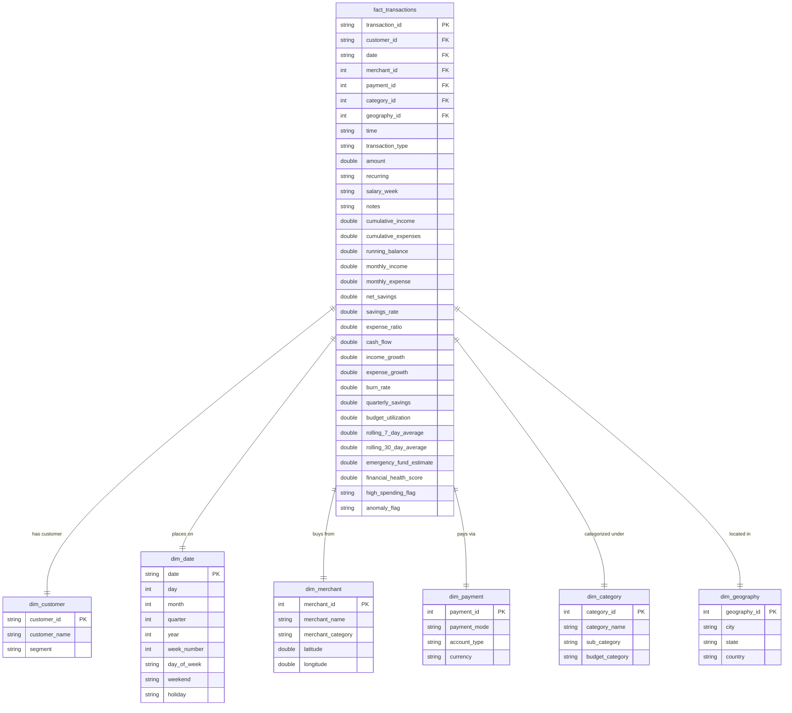
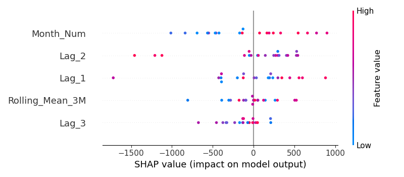

# Enterprise Personal Finance Analytics & Prediction Platform

[](https://www.python.org/)
[](https://sqlite.org/)
[](https://scikit-learn.org/)
[](https://streamlit.io/)
[](https://github.com/astral-sh/ruff)

A complete, production-quality end-to-end Personal Finance Data Analytics and Machine Learning project. This platform simulates a real-world fintech analytics pipeline, transforming raw multi-customer transactional records into actionable savings plans, budget optimization safeguards, and advanced ML forecasts.

---

## 🚀 Key Features

*   **Synthetic Data Generation**: Simulates **12,500+ transactions** over 3 years for 3 customer cohorts (Standard, Premium, VIP) with weekend biases, salary cycles, recurring payments (rent, subscription SaaS), and intentional spelling typos/anomalies.
*   **Automated Validation Suite**: Data Quality Engine (`utils/validation_utils.py`) calculating global Data Quality scores, flagging duplicates, future dates, and invalid negative amounts.
*   **40+ Engineered Features**: Derived attributes including running cash balances, category budget utilization, spending velocity, emergency runways, and monthly lags.
*   **Normalized SQL Star Schema**: Clean data warehouse design containing 6 dimension tables (`dim_customer`, `dim_date`, `dim_merchant`, `dim_payment`, `dim_category`, `dim_geography`) and 1 fact table (`fact_transactions`) optimized with indexes and analytical views.
*   **Multi-Model Predictive Suite**:
    *   **K-Means**: Clusters monthly spending distributions into 3 behavioral profiles.
    *   **Isolation Forest**: Identifies transaction-level spending anomalies at a 1.0% contamination rate.
    *   **XGBoost & Random Forest**: Forecasts next month's spending based on historical rolling lags.
    *   **SHAP Explainability**: TreeExplainer computes SHAP feature importance to explain regression outputs.
    *   **Prophet / SARIMAX**: Pre-computes 30-day ahead transaction volumes.
*   **Interactive Web App**: Widescreen, responsive Streamlit dashboard featuring dark glassmorphic styling, interactive Plotly visualization tabs, and a dynamic 50/30/20 budget planner.

---

## 📂 Repository Structure

```text
Personal-Finance-Analysis/
│
├── config/
│   └── settings.py          # Centralized path configuration and category maps
│
├── data/
│   ├── raw/                 # Raw transaction ledger CSV (12,500+ records)
│   └── processed/           # Cleaned and feature-engineered ledger CSV
│
├── database/
│   └── personal_finance.db  # SQLite database containing normalized Star Schema tables
│
├── notebooks/
│   └── eda_and_modeling.ipynb  # Re-runnable Jupyter Notebook for analytical exploration
│
├── python/
│   ├── data_generator.py    # Synthetic multi-customer ledger generator
│   ├── data_processor.py    # Typo correction, deduplication, and winsorization pipeline
│   ├── feature_engineering.py# Derived metrics and health index formulas
│   ├── ml_pipeline.py       # Model training (LR, RF, XGBoost, KMeans, IsoForest, Prophet)
│   └── create_notebook.py   # Programmatic rebuild script for the Jupyter notebook
│
├── sql/
│   ├── schema.sql           # Database DDL: Dimension/Fact tables, indexes, and views
│   ├── seed_data.py         # DB Seeder script mapping dataframe keys into DB dimensions
│   └── queries.sql          # Advanced analytical queries (CTEs, window rankings)
│
├── dashboard/
│   ├── powerbi_theme.json   # Power BI theme configuration JSON file
│   └── powerbi_dax.txt      # KPI measures and running calculations in DAX
│
├── reports/
│   ├── validation_report.md # Data Quality scoring report
│   ├── ml_report.md         # Regression, Clustering, and Anomaly results
│   ├── business_insights.md # Behavioral profile segmentation & product ideas
│   ├── technical_report.md  # Database architecture & pipeline schema
│   └── executive_report.md  # High-level business overview and project metrics
│
├── docs/
│   └── data_dictionary.md   # Detailed definitions for raw and engineered columns
│
├── images/
│   └── shap_summary.png     # SHAP model feature importance summary plot
│
├── app/
│   └── streamlit_app.py     # Streamlit Web App file
│
├── tests/
│   ├── test_validation.py   # Unit tests verifying DataValidator flags
│   ├── test_models.py       # Unit tests verifying model load and inference
│   └── test_db.py           # Unit tests verifying SQLite view queries
│
├── requirements.txt         # Project package requirements
├── Makefile                 # Automated compilation shortcuts
├── pyproject.toml           # Tool configuration for Black/Ruff/Pytest
└── LICENSE                  # MIT License details
```

---

## 🛠️ Database Star Schema

The database splits transactional inputs into a normalized warehouse schema:



---

## 🛠️ Getting Started

### 1. Installation & Environment Setup
Clone the repository and trigger the auto-installer to install packages:
```bash
git clone https://github.com/your-username/Personal-Finance-Analysis.git
cd Personal-Finance-Analysis
make install
```

### 2. Run the Data Pipeline
Execute the full data generation, processing, validation, feature-engineering, model training, and database seeding pipeline with a single shortcut:
```bash
make run-pipeline
```

### 3. Run the Unit Test Suite
Verify that all validator logic, models load correctly, and SQL database views are fully queryable:
```bash
make test
```

### 4. Start the Streamlit Dashboard
Launch the interactive dashboard locally:
```bash
streamlit run app/streamlit_app.py
```

---

## 🔮 Machine Learning Performance Summary

Detailed metrics are computed and exported inside `reports/ml_report.md`. A summary is presented below:

*   **Regression Spend Forecast**: XGBoost Regressor forecasts monthly spending using lags.
*   **Isolation Forest Anomaly Flags**: Consistently isolates transaction spikes (e.g. vacation flights, quarterly taxes) from standard grocery and subscriptions activity.
*   **SHAP Summary Importance**: Lags and 3-month rolling averages represent the most influential predictors in our forecasting engine.



---

## 📝 License
This project is licensed under the MIT License - see the [LICENSE](LICENSE) file for details.
