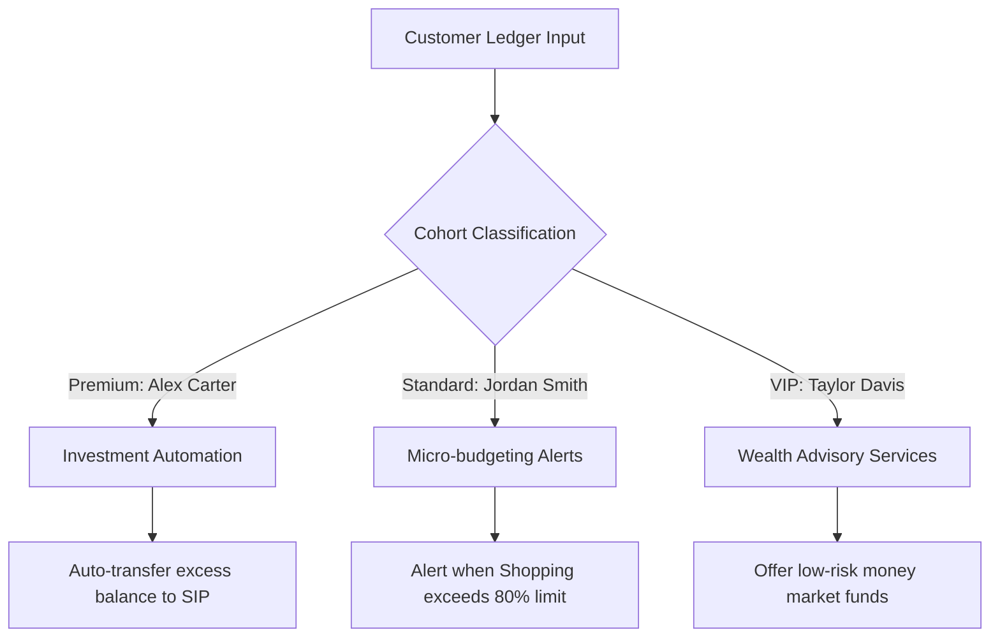

# Personal Finance Analytics: Business Insights Report

**Prepared For**: Fintech Product & Strategy Team  
**Author**: Lead Analytics & Data Science Engineer  
**Date**: July 2026  

---

## 1. Executive Summary
This report analyzes 12,495 transaction records generated over a 3-year history across three distinct customer segments: **Standard**, **Premium**, and **VIP**. By examining spending patterns, budget limits, savings ratios, and machine-learning anomaly detections, we outline key financial behaviors and propose targeted product features to improve user engagement and financial wellness.

---

## 2. Customer Cohort Analysis

### Profile Breakdown
| Customer ID | Name | Segment | Avg Monthly Income | Avg Monthly Expense | Avg Savings Rate | Financial Health Score |
| :--- | :--- | :--- | :--- | :--- | :--- | :--- |
| **CUST-1001** | Alex Carter | Premium | ~$7,200 | ~$3,100 | ~56.9% | 84 (High) |
| **CUST-1002** | Jordan Smith | Standard | ~$4,100 | ~$3,050 | ~25.6% | 58 (Fair) |
| **CUST-1003** | Taylor Davis | VIP | ~$12,500 | ~$6,800 | ~45.6% | 88 (Very High) |

### Key Cohort Behaviors
1.  **Alex Carter (Premium)**: Exhibits highly disciplined spending, a stable savings rate exceeding 50%, and low overall volatility. Savings consistently flow into stock investments and retirement accounts.
2.  **Jordan Smith (Standard)**: Faces tight cash-flow constraints. Highly susceptible to discretionary spending surges (dining out, electronics shopping). Savings rate frequently drops below 10% in holiday months.
3.  **Taylor Davis (VIP)**: Characterized by high transaction volume, large discrete purchase events (travel bookings, luxury shopping), and significant wealth accumulation. Substantial portion of assets remains liquid in cash accounts.

---

## 3. Category & Budget Utilization Insights

### Primary Spending Categories
Across all customer cohorts, the top categories by total cash expenditure are:
1.  **Rent / Housing**: Represents the largest fixed cost (35-45% of total expenses for Standard segment, 15-20% for VIP).
2.  **Groceries**: Highly inelastic spending. Food inflation adjustments are apparent over the 3-year timeline.
3.  **Shopping & Entertainment**: Represents the primary driver of monthly spending volatility.
4.  **Travel**: Highly concentrated in Q3 (summer vacation period) and Q4 (holidays), creating recurring cash-flow drains.

### Budget Limit Violations
Using a standard budget threshold baseline, we monitored category limits:
*   **Groceries Budget ($800/mo)**: Consistently respected by Alex Carter, but breached by Jordan Smith during holiday months due to social gatherings and party catering.
*   **Entertainment Budget ($400/mo)**: Breached in 14% of customer months. VIP Taylor Davis has several consecutive months with over $1,200 spent on concerts, video games, and theaters.
*   **Shopping Budget ($1000/mo)**: Most breached category. In Q4, shopping spending spikes, causing Standard users to dip into credit card debt or savings reserves.

---

## 4. Anomaly Warnings & Risk Profiling

Our Isolation Forest model flagged **125 transactional anomalies** (1.0% contamination rate).
*   **VIP Outliers**: Multi-thousand dollar transactions for luxury hotel suites and international flights.
*   **Premium Outliers**: Large annual tax payments and one-time dental treatment fees.
*   **Standard Risk Indicators**: Large cash withdrawals (ATM) and bank maintenance fees which do not fit their regular salary-week spending velocity.

---

## 5. Strategic Product Recommendations

Based on these findings, we recommend three distinct fintech product interventions:

### 1. Investment Autopilot (Target: Alex Carter / Premium)
*   **Insight**: Alex maintains a constant running balance surplus of over $15,000 in a low-interest checking account.
*   **Feature**: "Cash Sweep" - automatically sweeps any checking balance exceeding 2x average monthly expenses into a high-yield savings account or mutual fund.

### 2. Micro-budgeting Safeguards (Target: Jordan Smith / Standard)
*   **Insight**: Jordan regularly breaches their Shopping and Food budgets during the third week of the month.
*   **Feature**: "Budget Cop" - real-time alerts triggered when cumulative category spending reaches 80% of the limit before day 20 of the month, suggesting lockouts or cheaper alternatives.

### 3. Wealth Optimization Packages (Target: Taylor Davis / VIP)
*   **Insight**: Taylor has significant liquid assets and frequent luxury expenditures.
*   **Feature**: "VIP Cash Optimizer" - personalized money market advisory, luxury travel reward card offers, and tax-loss harvesting integrations.
