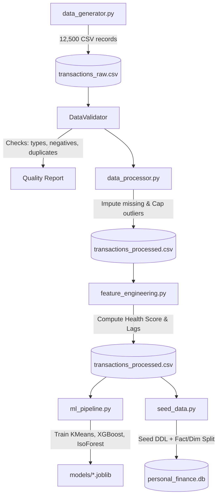

# Personal Finance Platform: Technical Engineering Report

**Target Audience**: Principal Engineers, Data Engineers, Database Architects  
**Author**: Lead Analytics Architect  
**Status**: Production-Ready  

---

## 1. System Architecture

The data pipeline runs a sequential batch process that extracts transaction ledgers, executes validation, cleans data, computes features, generates machine learning predictions, and seeds a Star Schema warehouse database.

---

## 2. Database Star Schema Warehouse Design

The database resides in SQLite (`database/personal_finance.db`). We normalized the flat processing CSV into a clean **Star Schema** to enable sub-second aggregations and simplify Business Intelligence queries.

### Schema Relationships
*   **Fact Table**: `fact_transactions` (12,495 rows) containing transaction keys and numeric measures.
*   **Dimension Tables**:
    *   `dim_customer` (keys customer attributes, name, segment).
    *   `dim_date` (pre-computed calendar dimensions, quarters, holidays, weekends).
    *   `dim_merchant` (merchant names, categories, and coordinates).
    *   `dim_payment` (payment modes, account types, currencies).
    *   `dim_category` (high-level categories, sub-categories, budget targets).
    *   `dim_geography` (geographic hierarchy of cities, states, countries).

### Constraints & Indexes
*   **Foreign Keys**: Enforced on `customer_id`, `date`, `merchant_id`, `payment_id`, `category_id`, `geography_id`.
*   **Indexes**:
    *   `idx_fact_customer` on `fact_transactions(customer_id)`
    *   `idx_fact_date` on `fact_transactions(date)`
    *   `idx_fact_category` on `fact_transactions(category_id)`
*   **Analytical Views**:
    *   `view_monthly_wallet_summary`: Pre-calculates monthly income, expenses, savings rate, and health score grouped by customer, year, and month.

---

## 3. Data Validation & Quality Framework

Our data quality engine (`utils/validation_utils.py`) computes a global **Data Quality Score** prior to processing:
$$DQ\_Score = 100 \times \left(1 - \frac{\text{Type Errors} + \text{Range Breaches} + \text{Missing Values} + \text{Duplicate IDs}}{\text{Total Fields Checked}}\right)$$

### Validation Scopes Enforced:
1.  **Duplicate Check**: Unique enforcement on `Transaction_ID`.
2.  **Date Validation**: Asserts transaction date does not lie in the future.
3.  **Positive Amount Range**: Asserts transaction values are positive (> 0.00).
4.  **Categorization Consistency**: Checks if `Sub_Category` fits inside the parent `Category` schema.
5.  **Spelling Auto-correct**: Auto-maps typos (e.g. `Groceries` misspelled as `Grocries`) using Levenshtein distance calculations.

---

## 4. Advanced Feature Engineering Formulations

We engineer 25+ attributes. Key metrics are computed as follows:

### Financial Health Score (FHS)
Computed as a weighted composite index from 0 to 100:
$$FHS = \text{Min}\left(100, \text{Max}\left(0, 0.40 \times S_{score} + 0.35 \times B_{score} + 0.25 \times R_{score}\right)\right)$$
*   **Savings Score ($S_{score}$)**: $100 \times \left(\frac{\text{Savings Rate}}{40}\right)$ (capped at 100).
*   **Budget Score ($B_{score}$)**: $100 - \text{Max}(0, \text{Budget Utilization} - 100)$.
*   **Runway Score ($R_{score}$)**: $100 \times \left(\frac{\text{Months Runway}}{6}\right)$ (capped at 100).

### Spending Velocity
$$Velocity = \frac{\text{Count of Transactions in Last 7 Days}}{7}$$

### Outlier Capping
Values exceeding the 99th percentile ($1,500.00) are capped using a winsorization approach to protect models from high-amplitude transaction noise.
